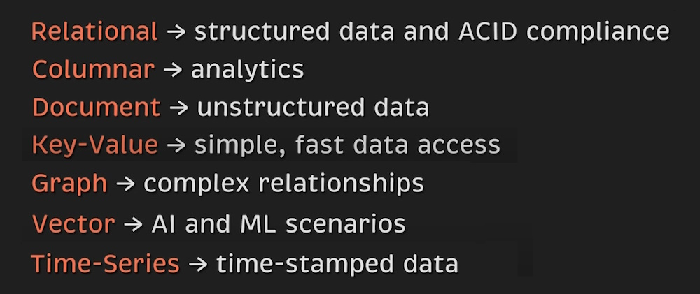
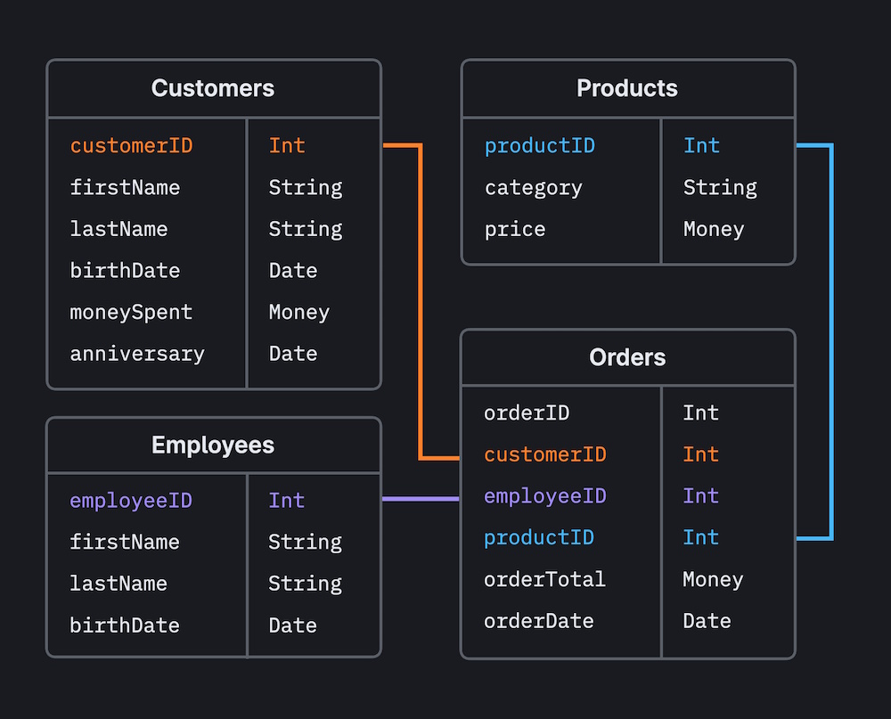
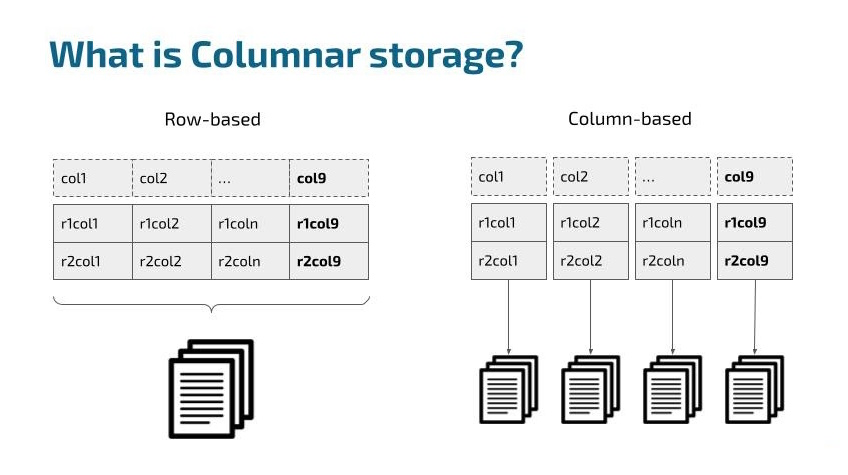
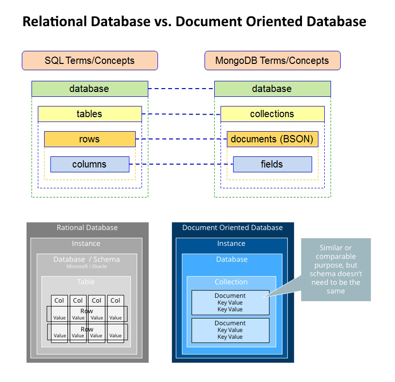
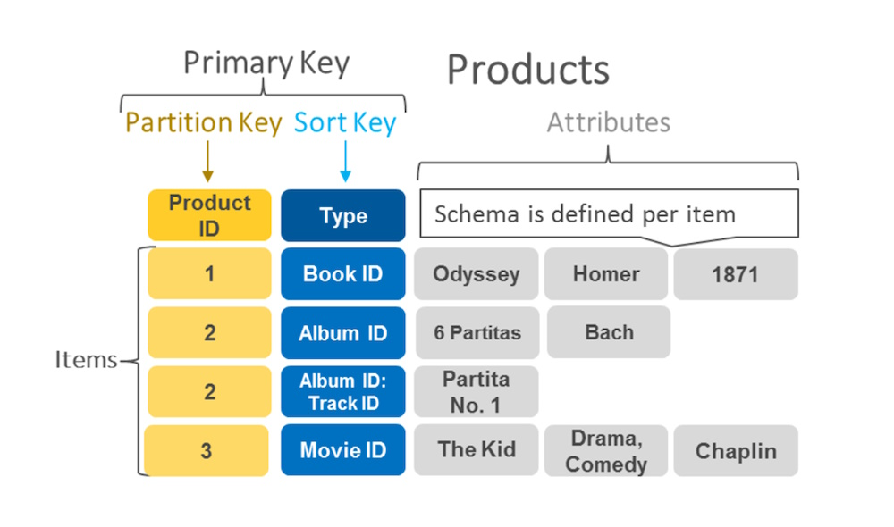
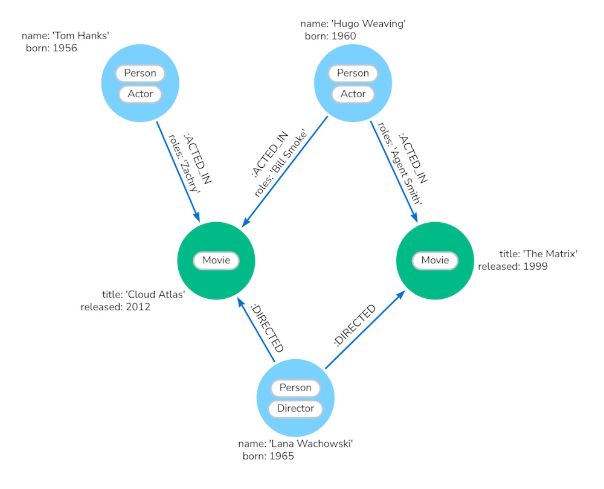
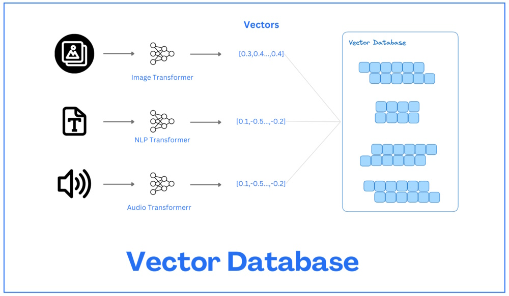
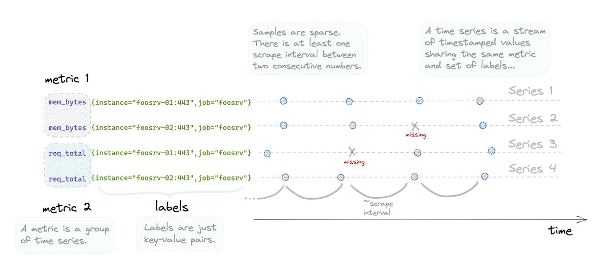

# An Introduction to Different Types of Databases

In modern application development, choosing the right database is critical for ensuring optimal performance, scalability, and reliability. Databases come in various forms, each optimized for specific data types, workloads, and use cases. **Understanding the different types of databases and their key features** will help in selecting the best solution for your application's needs. Below, we’ll explore seven main types of databases, their characteristics, and common use cases.

### 1. **Relational Database**

**Relational databases handle structured data with a well-defined schema**, typically using tables to store and organize data. They are built around **ACID compliance** (Atomicity, Consistency, Isolation, Durability), which ensures the integrity and reliability of data during transactions. This makes relational databases a popular choice for applications that require strict consistency.

- **Key Features**: Supports complex queries, joins, and relationships using tables. Relational databases are schema-based, meaning changes in the data model require schema changes.
- **Use Case**: Best suited for traditional business applications like **accounting**, **inventory management**, and **CRM systems**.
- **Examples**: **PostgreSQL**, **MySQL**.
- **Cloud Providers**: Amazon RDS (MySQL, PostgreSQL), Azure SQL Database, Cloud SQL (GCP).

### 2. **Columnar Database**

**Columnar databases are optimized for analytics over large datasets**, storing data in columns rather than rows. This structure allows faster retrieval of data when performing aggregations, making it ideal for analytical queries in big data scenarios.

- **Key Features**: Stores data in a columnar format, enabling fast access to large datasets for read-heavy workloads, especially aggregations.
- **Use Case**: Useful in **data warehousing**, **big data analytics**, and **reporting**, where large datasets need to be queried efficiently.
- **Examples**: **Apache Cassandra**, **HBase**, **Google Bigtable**.
- **Cloud Providers**: Amazon Redshift, Azure Synapse Analytics, BigQuery (GCP).

### 3. **Document Database**

**Document databases are designed for storing unstructured data**, where each record is stored as a document, typically in JSON or BSON format. This flexibility allows applications to store and retrieve various types of data without adhering to a strict schema.

- **Key Features**: Schema-less, allowing each document to contain different structures and data types, making it easy to adapt as data models evolve.
- **Use Case**: Ideal for applications like **content management systems**, **blogs**, and **catalogs**, where data structures are varied and change frequently.
- **Examples**: **MongoDB**, **CouchDB**.
- **Cloud Providers**: Amazon DocumentDB, Azure Cosmos DB (MongoDB API), Google Firestore.

### 4. **Key-Value Database**

**Key-Value databases offer simple, fast data access** by storing data as key-value pairs. The primary advantage of this model is its speed, as data can be retrieved directly using a unique key, without the need for complex queries.

- **Key Features**: Extremely fast and lightweight, best for use cases where quick data retrieval is needed and relationships between data points are minimal.
- **Use Case**: Commonly used for **caching systems**, **session management**, and **fast lookups** for items like user preferences or configurations.
- **Examples**: **Redis**, **Amazon DynamoDB**.
- **Cloud Providers**: Amazon DynamoDB, Azure Cosmos DB (Table API), Google Cloud Datastore.

### 5. **Graph Database**

**Graph databases specialize in handling complex relationships** between entities by representing data as nodes, edges, and properties. This structure is ideal for use cases where relationships between data points need to be explored and analyzed efficiently.

- **Key Features**: Uses graph structures to model data, making it easy to analyze relationships and perform graph-based queries such as shortest paths or friend-of-friend relationships.
- **Use Case**: Excellent for **social networks**, **recommendation engines**, and **fraud detection** systems where relationships between data points are key.
- **Examples**: **Neo4j**, **Dgraph**.
- **Cloud Providers**: Amazon Neptune, Azure Cosmos DB (Gremlin API), Neo4j (via GCP Marketplace).

### 6. **Vector Database**

**Vector databases are essential for AI and machine learning scenarios**, where vectors (multi-dimensional data) need to be stored and retrieved efficiently. These databases are optimized for tasks such as similarity searches, making them ideal for recommendation systems and AI-driven applications.

- **Key Features**: Optimized for storing and querying high-dimensional vectors, enabling fast similarity searches across large datasets.
- **Use Case**: Ideal for **AI-driven applications**, **recommendation systems**, **natural language processing (NLP)**, and **image recognition**.
- **Examples**: **Qdrant**, **Pinecone**.
- **Cloud Providers**: Amazon OpenSearch (Vector Search), Azure Cognitive Search, Vertex AI Matching Engine (GCP).

### 7. **Time-Series Database**

**Time-series databases are optimized for time-stamped data**, recording events along with their occurrence time. They are ideal for applications that need to handle vast amounts of time-ordered data efficiently and query based on specific time intervals.

- **Key Features**: Designed to efficiently handle time-ordered data, making them ideal for applications that need to analyze trends over time.
- **Use Case**: Commonly used in **IoT systems**, **financial systems**, **monitoring systems** (like server logs), and **sensor data** analytics.
- **Examples**: **Prometheus**, **InfluxDB**.
- **Cloud Providers**: Amazon Timestream, Azure Data Explorer (Kusto), Google Cloud Bigtable.

---

## Database Solutions from Cloud Providers

The major cloud providers—AWS, Azure, and GCP—offer a wide range of database services tailored to various use cases. Here's a quick reference table mapping database types to their corresponding cloud offerings and popular open-source projects:

| **Type of Database**   | **AWS**                  | **Azure**                       | **GCP**                       | **Open-Source Project**       | **Use Cases**                                                                 |
|------------------------|--------------------------|----------------------------------|-------------------------------|-------------------------------|------------------------------------------------------------------------------|
| **Relational**          | Amazon RDS (MySQL, PostgreSQL, Aurora) | Azure SQL Database | Cloud SQL, Spanner | MySQL, PostgreSQL, MariaDB | Financial systems, CRM, ERP, transactional systems                           |
| **Columnar**            | Amazon Redshift          | Azure Synapse Analytics          | BigQuery                      | Apache Cassandra, HBase       | Data warehousing, analytics, OLAP workloads                                  |
| **Document**            | Amazon DocumentDB        | Azure Cosmos DB (MongoDB API)    | Firestore, Datastore           | MongoDB, CouchDB               | Content management, catalogs, schema-less data storage                       |
| **Key-Value**           | Amazon DynamoDB          | Azure Cosmos DB (Table API)      | Cloud Firestore, Cloud Datastore | Redis, Memcached               | Caching, session management, fast lookups                                    |
| **Graph**               | Amazon Neptune           | Azure Cosmos DB (Gremlin API)    | Neo4j (via Marketplace)        | Dgraph, Neo4j, ArangoDB         | Social networks, recommendation engines, fraud detection                      |
| **Vector**              | Amazon OpenSearch (Vector Search) | Azure Cognitive Search        | Vertex AI Matching Engine      | Pinecone, Weaviate, Milvus     | AI-driven applications, NLP, image recognition                               |
| **Time-Series**         | Amazon Timestream        | Azure Data Explorer (Kusto)      | Cloud Bigtable                 | Prometheus, InfluxDB           | IoT systems, server metrics, time-stamped data, financial analysis           |

---

### Conclusion

**Choosing the right database type is essential for optimizing performance, scalability, and reliability**. Whether you need to handle large-scale data analytics, complex relationships, or high-speed key-value lookups, there is a specialized database for your specific use case. With cloud offerings and open-source options widely available, developers have more flexibility than ever to choose the best database technology for their application needs.

